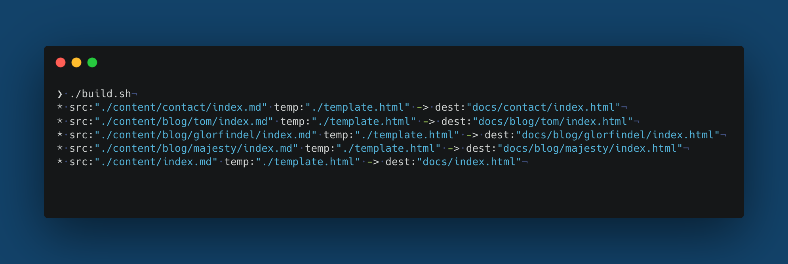

# Custom Static Site Generator (SSG)

A minimal static site generator built **from scratch in Python**.

This SSG recursively walks through a `content/` directory, converts Markdown files into HTML, injects them into an existing HTML template, and outputs a fully static website ready to be hosted on **GitHub Pages**.

The generated site lives in the `docs/` directory, which GitHub Pages uses to render your website.

## Features

* 📝 Write content in **Markdown**
* 🌀 Recursive directory traversal (nested content supported)
* 🎨 Customizable HTML template
* 💅 Custom CSS via `static/index.css`
* 🖼️ Static assets (images, etc.) served from `static/`
* 🚀 GitHub Pages–ready output (`docs/` folder)
* 🔁 Simple build and deploy workflow

## Project Structure

```text
.
├── content/              # Your markdown content (source of truth)
│   ├── index.md
│   └── posts/
│       └── example.md
│
├── static/
│   ├── index.css          # Main stylesheet (customizable)
│   └── images/            # Images used in markdown or templates
│
├── template.html          # Base HTML template
│
├── docs/                 # Generated HTML (used by GitHub Pages)
│
├── main.sh                # Local build + dev server
├── build.sh               # Production build (GitHub Pages)
└── README.md
```

## How It Works

1. The generator recursively walks through the `content/` directory.
2. Each `.md` file is converted into HTML.
3. The resulting HTML is injected into an existing HTML template.
4. Static assets (`CSS`, `images`) are copied from `static/`.
5. Final output is written to the `docs/` directory.

GitHub Pages automatically serves content from `docs/`.

## Getting Started

### 1. Fork the Repository

1. Click **Fork** at the top-right of this repository.
2. This creates your own copy under your GitHub account.

### 2. Clone Your Fork Locally

```bash
git clone https://github.com/<your-username>/<your-repo-name>.git
cd <your-repo-name>
```

(Optional) If you don’t want to keep the original repository as a remote:

```bash
git remote remove upstream
```

## Writing Content

### Markdown Files

* Create and save `.md` files inside the `content/` directory.
* Subdirectories are supported and preserved in the output structure.

Example:

From

```text
content/
├── index.md
└── blog/
    └── my-first-post.md
```

To

```text
docs/
├── index.html
└── blog/
    └── my-first-post.html
```

### Images

* Place images in:

```text
static/images/
```

* Reference them in Markdown like this:

```markdown

```

### Styling

* Edit `static/index.css` to customize how your site looks.
* All styling changes are reflected automatically on rebuild.

## Local Development

To build the site and preview it locally:

```bash
./main.sh
```

Then open your browser and go to:

```
http://localhost:8888
```

> **Recommended browser:** Chrome
> Browsers like Brave may produce unpredictable results due to caching or security features.

## Deploying to GitHub Pages

Once you’re satisfied with your site:

### 1. Build the Production Site

```bash
./build.sh
```

As in local deployment, this generates the final static HTML inside the `docs/` directory. You should see an output like the one below in local and public deployment:



### 2. Commit and Push

```bash
git add .
git commit -m "Build static site"
git push origin main
```

### 3. Enable GitHub Pages

1. Go to your repository on GitHub
2. Open **Settings → Pages**
3. Set:
   * **Source:** `Deploy from a branch`
   * **Branch:** `main`
   * **Folder:** `/docs`
4. Save

GitHub Pages will now render your site from the `docs/` directory.

## Static Sites Philosophy

The idea behind static site generators (and by extension static sites) is intentional simplicity.

- No frameworks.
- No hidden abstractions.
- No dynamic runtimes in the browser.
- And, not so surprisingly, secure.
